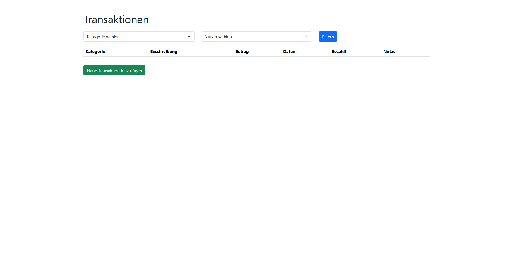
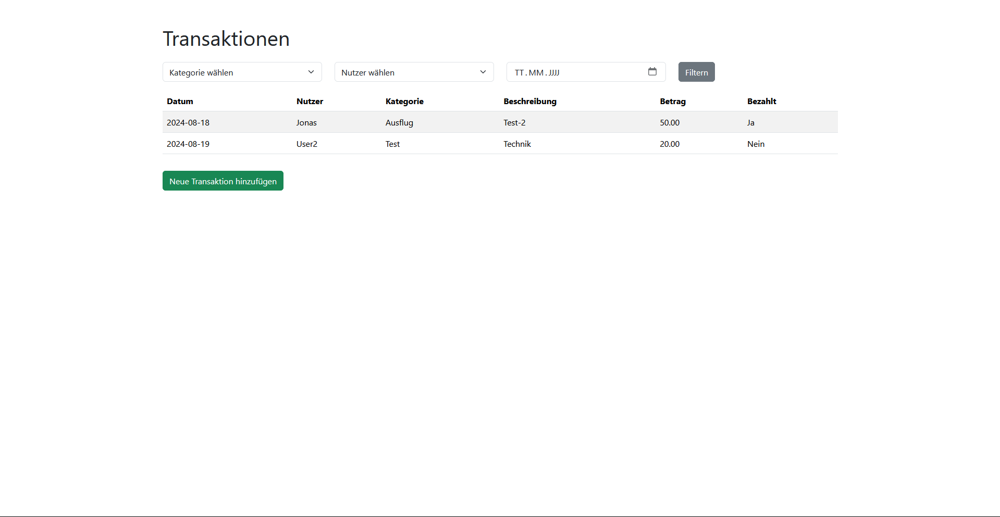

# Spending Documentation

## How to use it:
1. Clone the repository
2. Install the requirements with `pip install -r requirements.txt`
3. Create Database with `python create_db.py`
4. Run `python app.py`

## Routes:
- `/`: Home page List all Transactions
- `/add`: Add a new Transaction and create a new categorys and Users
- `/edit/<int:id>`: Edit a Transaction

## Features add in the future:
- [X] Edit Transaction
- [ ] Setup budget pots
- [ ] manage the budget pots
- [ ] see the total amount spent by category, user and total

## Preview:
### Main Page
With out transactions
  
With transactions
  
### Add Transaction
  