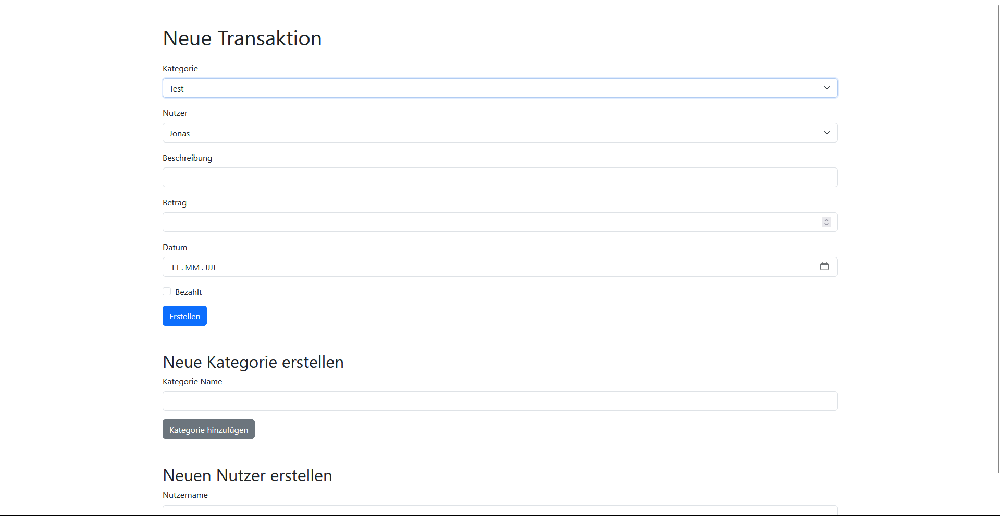

# Spending Documentation

## How to use it:
1. Clone the repository
2. Install the requirements with `pip install -r requirements.txt`
3. Create Database with `python create_db.py`
4. Run `python app.py`

## Routes:
- `/`: Home page List all Transactions
- `/add`: Add a new Transaction and create a new categorys and Users
- `/edit/<int:id>`: Edit a Transaction
- `/total`: Sort the total amount spent by category and user
- `/category/<int:category_id>`: See and manage the budget for this category

## Features add in the future:
- [X] Edit Transaction
- [X] Sites for all transactions
- [X] manage the budget pots
- [X] see the total amount spent by category, user and total

## Preview:
### Main Page
With out transactions
  
With transactions
  

### Add Transaction
  

### Edit Transaction
  

### Total Amount Spent by Category/User
  

### Category/Budget
  